# Authentication Service Design Document

## Overview

The authentication microservice is a critical security component that provides centralized authentication and authorization services for the entire platform. It implements multiple authentication methods, manages user sessions, enforces security policies, and provides secure APIs for other microservices to verify user identity and permissions.

The service follows a stateless JWT-based architecture with secure token management, comprehensive logging, and real-time security monitoring. It integrates with external identity providers and supports modern authentication standards including WebAuthn, OAuth2, and TOTP.

## Architecture

### High-Level Architecture

```mermaid
graph TB
    subgraph "Client Applications"
        WEB[Web App]
        MOBILE[Mobile App]
        API[API Clients]
    end
    
    subgraph "Auth Service - CENTRAL AUTHENTICATION HUB"
        GATEWAY[API Gateway]
        AUTH[Auth Controller]
        SESSION[Session Manager]
        MFA[MFA Handler]
        SOCIAL[Social Auth]
        PASSKEY[Passkey Handler]
        MAGIC[Magic Link Handler]
        TOKEN_VALIDATOR[Token Validator]
        PERMISSION_CHECKER[Permission Checker]
    end
    
    subgraph "External Services"
        GOOGLE[Google OAuth]
        FACEBOOK[Facebook OAuth]
        APPLE[Apple OAuth]
        GITHUB[GitHub OAuth]
        AMAZON[Amazon OAuth]
        TWITTER[X/Twitter OAuth]
        DISCORD[Discord OAuth]
        MICROSOFT[Microsoft OAuth]
        SMS[SMS Provider]
        EMAIL[Email Service]
    end
    
    subgraph "Data Layer"
        USERDB[(User Database)]
        SESSIONDB[(Session Store)]
        LOGDB[(Audit Logs)]
    end
    
    subgraph "Dependent Microservices - ALL REQUIRE AUTH"
        MULTIVENDOR[Multivendor Service]
        PAY[Payment Service]
        SOCIAL_SVC[Social Service]
        DELIVERY[Delivery Service]
    end
    
    %% Client Authentication Flow
    WEB --> GATEWAY
    MOBILE --> GATEWAY
    API --> GATEWAY
    
    %% Auth Service Internal Flow
    GATEWAY --> AUTH
    AUTH --> SESSION
    AUTH --> MFA
    AUTH --> SOCIAL
    AUTH --> PASSKEY
    AUTH --> MAGIC
    
    %% External Service Integration
    SOCIAL --> GOOGLE
    SOCIAL --> FACEBOOK
    SOCIAL --> APPLE
    SOCIAL --> GITHUB
    SOCIAL --> AMAZON
    SOCIAL --> TWITTER
    SOCIAL --> DISCORD
    SOCIAL --> MICROSOFT
    MFA --> SMS
    MAGIC --> EMAIL
    
    %% Data Storage
    AUTH --> USERDB
    SESSION --> SESSIONDB
    AUTH --> LOGDB
    
    %% CRITICAL: All microservices depend on Auth Service
    MULTIVENDOR -.->|Token Validation| TOKEN_VALIDATOR
    MULTIVENDOR -.->|Permission Check| PERMISSION_CHECKER
    PAY -.->|Token Validation| TOKEN_VALIDATOR
    PAY -.->|Permission Check| PERMISSION_CHECKER
    SOCIAL_SVC -.->|Token Validation| TOKEN_VALIDATOR
    SOCIAL_SVC -.->|Permission Check| PERMISSION_CHECKER
    DELIVERY -.->|Token Validation| TOKEN_VALIDATOR
    DELIVERY -.->|Permission Check| PERMISSION_CHECKER
    
    %% Service-to-Service Authentication
    MULTIVENDOR -.->|Service Token| AUTH
    PAY -.->|Service Token| AUTH
    SOCIAL_SVC -.->|Service Token| AUTH
    DELIVERY -.->|Service Token| AUTH
```



### Service Architecture Patterns

- **Microservice Pattern**: Standalone service with dedicated database
- **API Gateway Pattern**: Centralized entry point for all authentication requests
- **JWT Token Pattern**: Stateless authentication with signed tokens
- **Circuit Breaker Pattern**: Resilient integration with external services
- **Event Sourcing Pattern**: Comprehensive audit trail for security events

## Components and Interfaces

### Core Components

#### 1. Authentication Controller
- **Purpose**: Main API endpoint handler for authentication requests
- **Responsibilities**:
  - Route authentication requests to appropriate handlers
  - Validate input parameters and sanitize data
  - Coordinate multi-step authentication flows
  - Generate and return JWT tokens
  - Handle authentication errors and rate limiting

#### 2. Session Manager
- **Purpose**: Manages user sessions and JWT token lifecycle
- **Responsibilities**:
  - Generate secure JWT tokens with appropriate claims
  - Validate and refresh tokens
  - Maintain session state and expiration
  - Handle session invalidation and logout
  - Implement token blacklisting for security

#### 3. Multi-Factor Authentication (MFA) Handler
- **Purpose**: Implements TOTP and SMS-based MFA
- **Responsibilities**:
  - Generate and validate TOTP codes
  - Send and verify SMS codes
  - Manage MFA device registration
  - Handle backup codes for account recovery
  - Enforce MFA policies based on user roles

#### 4. Social Authentication Handler
- **Purpose**: Integrates with OAuth2 providers
- **Responsibilities**:
  - Handle OAuth2 authorization flows
  - Exchange authorization codes for access tokens
  - Retrieve user profile information
  - Link social accounts to platform accounts
  - Handle OAuth2 error scenarios

#### 5. Passkey Handler
- **Purpose**: Implements WebAuthn for passwordless authentication
- **Responsibilities**:
  - Generate WebAuthn challenges
  - Validate authenticator responses
  - Manage registered authenticators
  - Handle device registration and removal
  - Support cross-platform authenticators

#### 6. Magic Link Handler
- **Purpose**: Generates and validates email-based authentication links
- **Responsibilities**:
  - Generate secure, time-limited magic links
  - Send magic links via email service
  - Validate magic link tokens
  - Handle link expiration and security
  - Support deep linking for mobile apps

### External Interfaces

#### REST API Endpoints

```
POST /auth/login
POST /auth/logout
POST /auth/refresh
POST /auth/register
POST /auth/verify-token
GET  /auth/user-profile
POST /auth/change-password
POST /auth/reset-password

POST /auth/mfa/setup
POST /auth/mfa/verify
POST /auth/mfa/disable
GET  /auth/mfa/backup-codes

POST /auth/social/google
POST /auth/social/facebook
POST /auth/social/apple
POST /auth/social/github
POST /auth/social/amazon
POST /auth/social/twitter
POST /auth/social/discord
POST /auth/social/microsoft
POST /auth/social/link
DELETE /auth/social/unlink

POST /auth/passkey/register
POST /auth/passkey/authenticate
GET  /auth/passkey/list
DELETE /auth/passkey/remove

POST /auth/magic-link/send
POST /auth/magic-link/verify

GET  /auth/security/sessions
DELETE /auth/security/sessions/{id}
GET  /auth/security/login-history
POST /auth/security/report-suspicious

GET  /auth/admin/users
GET  /auth/admin/security-metrics
GET  /auth/admin/audit-logs
POST /auth/admin/security-policies
```

#### Service-to-Service APIs (CRITICAL FOR ALL MICROSERVICES)

```
# Token Validation - REQUIRED by all services
POST /internal/validate-token
  - Input: JWT token
  - Output: User ID, roles, permissions, token validity
  - Used by: ALL microservices for every authenticated request

# Permission Checking - REQUIRED for authorization
POST /internal/check-permissions
  - Input: User ID, resource, action
  - Output: Permission granted/denied
  - Used by: ALL microservices for resource access control

# User Role Management - REQUIRED for role-based features
GET  /internal/user-roles
  - Input: User ID
  - Output: User roles and hierarchical permissions
  - Used by: ALL microservices for role-based functionality

# Service Authentication - REQUIRED for service-to-service calls
POST /internal/create-service-token
  - Input: Service credentials
  - Output: Service authentication token
  - Used by: ALL microservices for inter-service communication

# Health Check - REQUIRED for service monitoring
GET  /internal/health
  - Output: Service health status
  - Used by: ALL microservices and monitoring systems
```

#### Microservice Integration Requirements

**MANDATORY INTEGRATION FOR ALL SERVICES:**

1. **Token Validation Middleware**
   - Every microservice MUST implement middleware that calls `/internal/validate-token`
   - All authenticated endpoints MUST validate tokens before processing requests
   - Invalid tokens MUST result in 401 Unauthorized responses

2. **Permission Checking**
   - Resource access MUST be validated through `/internal/check-permissions`
   - Role-based features MUST query `/internal/user-roles`
   - Authorization failures MUST result in 403 Forbidden responses

3. **Service Authentication**
   - Inter-service calls MUST use service tokens from `/internal/create-service-token`
   - Service tokens MUST be refreshed before expiration
   - Failed service authentication MUST trigger alerts

4. **Error Handling**
   - Auth service unavailability MUST be handled gracefully
   - Circuit breaker pattern MUST be implemented for auth calls
   - Fallback mechanisms MUST be defined for critical operations

## Data Models

### User Model
```php
class User {
    public int $id;
    public string $email;
    public ?string $phone;
    public string $password_hash;
    public string $role; // admin, vendor, customer, guest, delivery_partner, management_staff
    public array $permissions;
    public bool $email_verified;
    public bool $phone_verified;
    public bool $mfa_enabled;
    public ?string $mfa_secret;
    public array $backup_codes;
    public DateTime $created_at;
    public DateTime $updated_at;
    public ?DateTime $last_login;
    public bool $is_active;
    public array $security_settings;
}
```

### Session Model
```php
class Session {
    public string $id;
    public int $user_id;
    public string $token_hash;
    public string $device_info;
    public string $ip_address;
    public string $user_agent;
    public DateTime $created_at;
    public DateTime $expires_at;
    public ?DateTime $last_activity;
    public bool $is_active;
    public string $session_type; // web, mobile, api
}
```

### Social Account Model
```php
class SocialAccount {
    public int $id;
    public int $user_id;
    public string $provider; // google, facebook, apple, github, amazon, twitter, discord, microsoft
    public string $provider_id;
    public string $provider_email;
    public array $provider_data;
    public DateTime $linked_at;
    public DateTime $updated_at;
}
```

### Passkey Model
```php
class Passkey {
    public int $id;
    public int $user_id;
    public string $credential_id;
    public string $public_key;
    public string $device_name;
    public int $sign_count;
    public DateTime $created_at;
    public DateTime $last_used;
    public bool $is_active;
}
```

### Audit Log Model
```php
class AuditLog {
    public int $id;
    public ?int $user_id;
    public string $event_type;
    public string $event_description;
    public string $ip_address;
    public string $user_agent;
    public array $metadata;
    public DateTime $created_at;
    public string $severity; // info, warning, error, critical
}
```

## Error Handling

### Error Response Format
```json
{
    "success": false,
    "error": {
        "code": "AUTH_001",
        "message": "Invalid credentials",
        "details": "The provided email or password is incorrect",
        "timestamp": "2024-01-15T10:30:00Z",
        "request_id": "req_123456789"
    }
}
```

### Error Codes
- **AUTH_001**: Invalid credentials
- **AUTH_002**: Account locked
- **AUTH_003**: MFA required
- **AUTH_004**: Token expired
- **AUTH_005**: Token invalid
- **AUTH_006**: Rate limit exceeded
- **AUTH_007**: Account not verified
- **AUTH_008**: Social auth failed
- **AUTH_009**: Passkey registration failed
- **AUTH_010**: Magic link expired

### Security Error Handling
- Log all authentication failures with detailed context
- Implement progressive delays for repeated failures
- Trigger security alerts for suspicious patterns
- Provide generic error messages to prevent information disclosure
- Maintain detailed internal logs for security analysis

## Testing Strategy

### Unit Testing
- Test all authentication methods independently
- Validate JWT token generation and validation
- Test MFA code generation and verification
- Verify password hashing and validation
- Test rate limiting and security policies

### Integration Testing
- Test OAuth2 flows with external providers
- Validate email and SMS service integration
- Test database operations and transactions
- Verify API endpoint responses and error handling
- Test service-to-service authentication

### Security Testing
- Penetration testing for authentication vulnerabilities
- Test rate limiting and brute force protection
- Validate token security and expiration handling
- Test session management and invalidation
- Verify encryption and data protection measures

### Performance Testing
- Load testing for authentication endpoints
- Stress testing for concurrent user sessions
- Performance testing for token validation
- Database performance under high load
- External service integration performance

### End-to-End Testing
- Complete user registration and login flows
- Multi-factor authentication scenarios
- Social login integration testing
- Password reset and account recovery
- Cross-device authentication testing

## Security Considerations

### Data Protection
- Use bcrypt for password hashing with appropriate cost factor
- Encrypt sensitive data at rest using AES-256
- Use TLS 1.3 for all communications
- Implement proper key management and rotation
- Follow GDPR and data protection regulations

### Authentication Security
- Implement account lockout after failed attempts
- Use secure random token generation
- Implement proper session timeout policies
- Validate all input parameters and sanitize data
- Use CSRF protection for web applications

### Authorization Security
- Implement principle of least privilege
- Use role-based access control (RBAC)
- Validate permissions on every request
- Implement resource-level authorization
- Audit all authorization decisions

### Monitoring and Alerting
- Monitor authentication success/failure rates
- Alert on suspicious login patterns
- Track token usage and validation metrics
- Monitor external service integration health
- Implement real-time security event detection

## Deployment and Configuration

### Environment Configuration
```yaml
# Database Configuration
DB_HOST: localhost
DB_PORT: 3306
DB_NAME: auth_service
DB_USERNAME: auth_user
DB_PASSWORD: secure_password

# JWT Configuration
JWT_SECRET: secure_jwt_secret_key
JWT_EXPIRY: 3600
JWT_REFRESH_EXPIRY: 604800

# External Services
GOOGLE_CLIENT_ID: google_oauth_client_id
GOOGLE_CLIENT_SECRET: google_oauth_secret
FACEBOOK_APP_ID: facebook_app_id
FACEBOOK_APP_SECRET: facebook_app_secret
APPLE_CLIENT_ID: apple_client_id
APPLE_PRIVATE_KEY: apple_private_key

# Communication Services
SMS_PROVIDER_API_KEY: sms_api_key
EMAIL_SERVICE_API_KEY: email_api_key

# Security Settings
RATE_LIMIT_REQUESTS: 100
RATE_LIMIT_WINDOW: 3600
ACCOUNT_LOCKOUT_ATTEMPTS: 5
ACCOUNT_LOCKOUT_DURATION: 1800
```

### Deployment Architecture
- Deploy as containerized service on Wasmer.io
- Use environment-specific configuration files
- Implement health checks and monitoring
- Configure load balancing for high availability
- Set up automated backup and recovery procedures