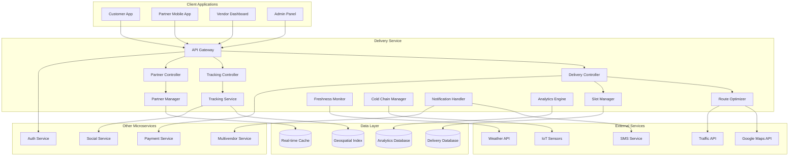

# Delivery Service Design Document

## Overview

The delivery microservice is a specialized logistics platform that manages end-to-end delivery operations for fresh produce and perishable goods. It provides intelligent route optimization, real-time tracking, cold-chain management, and delivery partner coordination. The service ensures product freshness through temperature monitoring, optimized delivery windows, and efficient logistics management.

The service follows an event-driven architecture with real-time updates, geospatial optimization, and mobile-first design for delivery partners. It integrates with mapping services, weather APIs, and IoT sensors for comprehensive delivery management.

## Architecture

### High-Level Architecture



### Service Architecture Patterns

- **Microservice Pattern**: Standalone delivery service with specialized databases
- **Event-Driven Pattern**: Real-time updates and notifications
- **Geospatial Pattern**: Location-based services and optimization
- **Mobile-First Pattern**: Optimized for delivery partner mobile apps
- **IoT Integration Pattern**: Cold-chain monitoring and sensor data
- **Real-time Pattern**: Live tracking and status updates

## Components and Interfaces

### Core Components

#### 1. Route Optimizer
- **Purpose**: Intelligent route planning and optimization
- **Responsibilities**:
  - Generate optimal delivery routes considering traffic and distance
  - Handle multi-stop deliveries with time window constraints
  - Adapt routes in real-time based on traffic and delays
  - Optimize for fuel efficiency and delivery time
  - Support cold-chain delivery requirements

#### 2. Slot Manager
- **Purpose**: Manages delivery time slots and capacity
- **Responsibilities**:
  - Calculate available delivery slots based on capacity
  - Respect freshness windows for perishable products
  - Handle slot booking and cancellations
  - Manage vendor-specific delivery zones
  - Optimize slot allocation for efficiency

#### 3. Tracking Service
- **Purpose**: Real-time delivery tracking and monitoring
- **Responsibilities**:
  - Track delivery partner GPS location
  - Provide real-time updates to customers
  - Monitor delivery progress and delays
  - Handle delivery status updates
  - Generate delivery completion confirmations

#### 4. Partner Manager
- **Purpose**: Delivery partner management and coordination
- **Responsibilities**:
  - Manage partner onboarding and verification
  - Track partner performance and ratings
  - Handle partner assignment and scheduling
  - Manage partner payments and incentives
  - Provide partner support and communication

#### 5. Freshness Monitor
- **Purpose**: Ensures product freshness throughout delivery
- **Responsibilities**:
  - Monitor temperature and humidity during transport
  - Alert on freshness violations
  - Optimize delivery sequences for perishables
  - Track cold-chain compliance
  - Generate freshness reports

#### 6. Cold Chain Manager
- **Purpose**: Specialized cold-chain delivery management
- **Responsibilities**:
  - Verify cold-chain vehicle capabilities
  - Monitor temperature sensors in real-time
  - Handle temperature alerts and violations
  - Manage cold-chain partner assignments
  - Ensure compliance with food safety standards

### External Interfaces

#### REST API Endpoints

```
# Delivery Management
POST /deliveries/schedule
GET  /deliveries/{id}
PUT  /deliveries/{id}/status
GET  /deliveries/history
POST /deliveries/reschedule

# Delivery Slots
GET  /slots/available
POST /slots/book
PUT  /slots/{id}/cancel
GET  /slots/vendor/{vendorId}

# Tracking
GET  /tracking/{deliveryId}
POST /tracking/{deliveryId}/update
GET  /tracking/{deliveryId}/history
POST /tracking/{deliveryId}/proof

# Partner Management
POST /partners/register
GET  /partners/{id}
PUT  /partners/{id}/status
GET  /partners/available
POST /partners/{id}/assign

# Route Optimization
POST /routes/optimize
GET  /routes/{partnerId}/current
PUT  /routes/{partnerId}/update
GET  /routes/analytics

# Cold Chain
GET  /cold-chain/{deliveryId}/status
POST /cold-chain/{deliveryId}/alert
GET  /cold-chain/compliance
GET  /cold-chain/reports

# Analytics
GET  /analytics/delivery-performance
GET  /analytics/partner-metrics
GET  /analytics/zone-analysis
GET  /analytics/freshness-reports
```

#### Service-to-Service APIs

```
POST /internal/create-delivery
GET  /internal/delivery-status
POST /internal/update-delivery
GET  /internal/partner-availability
POST /internal/calculate-delivery-cost
GET  /internal/delivery-zones
POST /internal/notify-delivery-update
GET  /internal/health
```

#### Mobile Partner App APIs

```
GET  /mobile/partner/deliveries
POST /mobile/partner/status-update
POST /mobile/partner/location-update
POST /mobile/partner/delivery-proof
GET  /mobile/partner/route
POST /mobile/partner/issue-report
GET  /mobile/partner/earnings
```

## Data Models

### Delivery Model
```php
class Delivery {
    public string $id;
    public int $order_id;
    public int $customer_id;
    public int $vendor_id;
    public ?int $partner_id;
    public string $status; // scheduled, assigned, in_transit, delivered, failed
    public DateTime $scheduled_at;
    public ?DateTime $assigned_at;
    public ?DateTime $picked_up_at;
    public ?DateTime $delivered_at;
    public array $pickup_address;
    public array $delivery_address;
    public array $delivery_instructions;
    public bool $requires_cold_chain;
    public float $delivery_fee;
    public array $items;
    public array $tracking_data;
    public ?string $failure_reason;
    public array $proof_of_delivery;
}
```

### Delivery Partner Model
```php
class DeliveryPartner {
    public int $id;
    public string $name;
    public string $phone;
    public string $email;
    public string $license_number;
    public array $vehicle_details;
    public bool $cold_chain_certified;
    public string $status; // active, inactive, suspended
    public array $service_zones;
    public float $rating;
    public int $total_deliveries;
    public DateTime $created_at;
    public DateTime $last_active;
    public array $bank_details;
    public array $documents;
}
```

### Delivery Slot Model
```php
class DeliverySlot {
    public string $id;
    public int $vendor_id;
    public string $zone_id;
    public DateTime $start_time;
    public DateTime $end_time;
    public int $capacity;
    public int $booked_count;
    public bool $cold_chain_available;
    public float $delivery_fee;
    public array $restrictions;
    public bool $is_active;
}
```

### Route Model
```php
class Route {
    public string $id;
    public int $partner_id;
    public DateTime $date;
    public array $stops; // Array of delivery stops
    public float $total_distance;
    public int $estimated_duration;
    public string $status; // planned, in_progress, completed
    public array $optimization_data;
    public DateTime $started_at;
    public ?DateTime $completed_at;
    public array $actual_path;
}
```

### Cold Chain Log Model
```php
class ColdChainLog {
    public string $id;
    public string $delivery_id;
    public float $temperature;
    public float $humidity;
    public DateTime $recorded_at;
    public array $location;
    public string $sensor_id;
    public bool $is_violation;
    public ?string $alert_sent;
}
```

## Error Handling

### Error Response Format
```json
{
    "success": false,
    "error": {
        "code": "DEL_001",
        "message": "Delivery slot not available",
        "details": "The requested time slot is fully booked",
        "timestamp": "2024-01-15T10:30:00Z",
        "request_id": "req_123456789"
    }
}
```

### Error Codes
- **DEL_001**: Delivery slot not available
- **DEL_002**: Invalid delivery address
- **DEL_003**: No partners available
- **DEL_004**: Cold chain requirement not met
- **DEL_005**: Delivery zone not supported
- **PAR_001**: Partner not found
- **PAR_002**: Partner not available
- **PAR_003**: Partner verification failed
- **TRK_001**: Tracking data unavailable
- **TRK_002**: Location update failed
- **ROU_001**: Route optimization failed
- **ROU_002**: Invalid route parameters

## Testing Strategy

### Unit Testing
- Test route optimization algorithms
- Validate slot availability calculations
- Test cold-chain monitoring logic
- Verify partner assignment algorithms
- Test delivery status transitions

### Integration Testing
- Test mapping service integrations
- Validate IoT sensor data processing
- Test real-time tracking updates
- Verify notification delivery
- Test mobile app API endpoints

### Performance Testing
- Load testing for route optimization
- Stress testing for real-time tracking
- Performance testing for geospatial queries
- Database performance under high load
- Mobile app performance optimization

### End-to-End Testing
- Complete delivery workflow testing
- Cold-chain delivery scenarios
- Partner mobile app workflows
- Customer tracking experience
- Multi-stop delivery optimization

## Security Considerations

### Data Protection
- Encrypt location data and personal information
- Implement secure communication for partner apps
- Protect customer delivery addresses
- Secure IoT sensor data transmission
- Follow data privacy regulations

### Partner Security
- Verify partner identity and credentials
- Secure partner mobile app authentication
- Protect partner earnings and payment data
- Implement secure document storage
- Monitor partner account security

### Operational Security
- Secure real-time tracking data
- Protect route optimization algorithms
- Implement secure API authentication
- Monitor for fraudulent activities
- Secure cold-chain sensor networks

## Deployment and Configuration

### Environment Configuration
```yaml
# Database Configuration
DB_HOST: localhost
DB_PORT: 3306
DB_NAME: delivery_service
DB_USERNAME: delivery_user
DB_PASSWORD: secure_password

# External Services
GOOGLE_MAPS_API_KEY: google_maps_key
WEATHER_API_KEY: weather_api_key
TRAFFIC_API_KEY: traffic_api_key
SMS_API_KEY: sms_api_key

# IoT Configuration
IOT_ENDPOINT: https://iot.platform.com
IOT_API_KEY: iot_api_key
COLD_CHAIN_SENSORS: sensor_config

# Business Configuration
DEFAULT_DELIVERY_FEE: 50
COLD_CHAIN_SURCHARGE: 25
MAX_DELIVERY_DISTANCE: 50
FRESHNESS_WINDOW_HOURS: 4
PARTNER_COMMISSION_RATE: 0.15
```