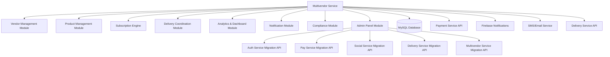

# Design Document

## Overview

The multivendor service is designed as a comprehensive vendor management platform that handles the complete lifecycle of vendor operations, from onboarding to payout processing. The service integrates with external payment systems, notification services, and delivery coordination systems while maintaining strict food safety compliance and traceability.

## Architecture

### High-Level Architecture



### Service Integration Points

- **Payment Service**: For payout processing and transaction management
- **Auth Service**: For vendor authentication and role management
- **Delivery Service**: For delivery slot coordination and capacity management
- **Social Service**: For vendor-customer communication features
- **Firebase**: For real-time notifications across all vendor touchpoints

## Components and Interfaces

### 1. Vendor Management Module

**Purpose**: Handle vendor registration, KYC, profile management, and role assignments.

**Key Classes**:
- `VendorRegistrationService`: Manages onboarding workflow
- `VendorProfileManager`: Handles profile updates and validation
- `VendorRoleManager`: Manages multi-role access (owner, manager, delivery staff)
- `KYCValidator`: Validates business documents and FSSAI licenses

**Database Tables**:
- `vendors`: Core vendor information
- `vendor_documents`: KYC and certification storage
- `vendor_roles`: Role assignments and permissions
- `vendor_locations`: Business location and service areas

### 2. Product Management Module

**Purpose**: Manage vendor product catalogs with perishable-specific attributes.

**Key Classes**:
- `ProductCatalogManager`: CRUD operations for vendor products
- `InventoryTracker`: Stock level monitoring and batch tracking
- `ExpiryManager`: Automated expiry handling and cart cleanup
- `BatchTraceabilityService`: Maintains batch-to-order mapping

**Database Tables**:
- `products`: Product catalog with perishable attributes
- `inventory_batches`: Batch tracking with expiry and origin data
- `stock_levels`: Real-time inventory levels
- `product_traceability`: Batch → Vendor → Location → Order mapping

### 3. Subscription Engine

**Purpose**: Handle recurring order generation and customer subscription management.

**Key Classes**:
- `SubscriptionManager`: Customer subscription CRUD operations
- `OrderGenerator`: Nightly automated order creation (2AM cron job)
- `CapacityChecker`: Vendor delivery capacity validation
- `SubscriptionScheduler`: Manages pause/resume logic

**Database Tables**:
- `customer_subscriptions`: Subscription preferences and schedules
- `subscription_orders`: Generated orders from subscriptions
- `delivery_capacity`: Vendor capacity tracking by time slots
- `subscription_history`: Audit trail of subscription changes

### 4. Delivery Coordination Module

**Purpose**: Coordinate delivery slots, cold-chain requirements, and order consolidation.

**Key Classes**:
- `DeliverySlotManager`: Manages time slots and freshness windows
- `ColdChainValidator`: Ensures cold-chain capable vendors for temperature-sensitive products
- `OrderConsolidator`: Merges subscription and on-demand orders
- `DeliveryFailureHandler`: Processes missed deliveries and refunds

**Database Tables**:
- `delivery_slots`: Available delivery windows with freshness constraints
- `vendor_capabilities`: Cold-chain and delivery capacity information
- `consolidated_orders`: Merged orders by location/vendor/slot
- `delivery_failures`: Failed delivery tracking and refund processing

### 5. Analytics & Dashboard Module

**Purpose**: Provide comprehensive vendor analytics and business intelligence.

**Key Classes**:
- `VendorDashboardService`: Aggregates vendor performance data
- `SalesAnalytics`: Revenue, order, and performance metrics
- `FeedbackAggregator`: Customer feedback compilation and analysis
- `ReportGenerator`: Automated report generation for vendors

**Database Tables**:
- `vendor_analytics`: Aggregated performance metrics
- `sales_reports`: Historical sales data and trends
- `customer_feedback`: Feedback and ratings storage
- `vendor_notifications`: Notification history and preferences

### 6. Notification Module

**Purpose**: Handle multi-channel notifications (Firebase, SMS, Email) for vendors.

**Key Classes**:
- `NotificationDispatcher`: Routes notifications to appropriate channels
- `StockAlertService`: Predictive stock alerts and low inventory warnings
- `DeliveryNotificationService`: Delivery status and failure notifications
- `PromotionNotificationService`: Marketing and promotion alerts

**Integration Points**:
- Firebase Admin SDK for push notifications
- SMS gateway integration
- Email service integration
- Notification preferences management

### 7. Compliance Module

**Purpose**: Ensure food safety compliance and regulatory reporting.

**Key Classes**:
- `FSSAIValidator`: License validation and compliance checking
- `TraceabilityReporter`: Generate traceability reports for incidents
- `ComplianceAuditor`: Automated compliance checking
- `IncidentTracker`: Food safety incident management

**Database Tables**:
- `compliance_records`: FSSAI and certification tracking
- `traceability_logs`: Complete product journey tracking
- `safety_incidents`: Food safety incident records
- `audit_trails`: Compliance audit history

### 8. Admin Panel Module

**Purpose**: Provide centralized administration interface for managing database migrations and system setup across all microservices.

**Key Classes**:
- `AdminAuthenticator`: Handles admin login with environment variable credentials
- `MigrationOrchestrator`: Coordinates migrations across all microservices
- `ServiceHealthChecker`: Monitors microservice availability and database connectivity
- `MigrationHistoryTracker`: Tracks migration status and execution history

**Key Features**:
- **Authentication**: Uses `ADMIN_USERNAME` and `ADMIN_PASSWORD` environment variables (defaults to "admin"/"admin")
- **Multi-Service Migration**: Executes migrations for auth, pay, social, delivery, and multivendor services
- **Real-time Progress**: WebSocket-based progress updates during migration execution
- **Rollback Support**: Ability to rollback failed migrations with detailed error reporting
- **One-Click Setup**: Initial system setup with all required schemas and seed data

**Database Tables**:
- `migration_history`: Track migration execution across all services
- `admin_sessions`: Admin authentication session management
- `service_health`: Monitor microservice availability and status

**Integration Points**:
- HTTP APIs to each microservice's migration endpoints
- WebSocket connections for real-time progress updates
- Service discovery for dynamic microservice endpoint resolution

## Data Models

### Core Entities

```sql
-- Vendors table with comprehensive business information
CREATE TABLE vendors (
    id BIGINT PRIMARY KEY AUTO_INCREMENT,
    business_name VARCHAR(255) NOT NULL,
    business_type ENUM('dairy', 'vegetables', 'mixed') NOT NULL,
    fssai_license VARCHAR(50) UNIQUE NOT NULL,
    owner_name VARCHAR(255) NOT NULL,
    phone VARCHAR(20) NOT NULL,
    email VARCHAR(255) NOT NULL,
    address TEXT NOT NULL,
    latitude DECIMAL(10, 8),
    longitude DECIMAL(11, 8),
    cold_chain_capable BOOLEAN DEFAULT FALSE,
    status ENUM('pending', 'active', 'suspended') DEFAULT 'pending',
    created_at TIMESTAMP DEFAULT CURRENT_TIMESTAMP,
    updated_at TIMESTAMP DEFAULT CURRENT_TIMESTAMP ON UPDATE CURRENT_TIMESTAMP
);

-- Products with perishable-specific attributes
CREATE TABLE products (
    id BIGINT PRIMARY KEY AUTO_INCREMENT,
    vendor_id BIGINT NOT NULL,
    name VARCHAR(255) NOT NULL,
    category ENUM('dairy', 'vegetables', 'fruits') NOT NULL,
    packaging_type ENUM('loose', 'bottle', 'sealed', 'bag') NOT NULL,
    is_organic BOOLEAN DEFAULT FALSE,
    farm_origin VARCHAR(255),
    shelf_life_hours INT NOT NULL,
    price_per_unit DECIMAL(10, 2) NOT NULL,
    unit_type ENUM('kg', 'liter', 'piece', 'gram') NOT NULL,
    status ENUM('active', 'inactive') DEFAULT 'active',
    created_at TIMESTAMP DEFAULT CURRENT_TIMESTAMP,
    FOREIGN KEY (vendor_id) REFERENCES vendors(id)
);

-- Inventory batches for traceability
CREATE TABLE inventory_batches (
    id BIGINT PRIMARY KEY AUTO_INCREMENT,
    product_id BIGINT NOT NULL,
    batch_number VARCHAR(100) NOT NULL,
    production_date DATE NOT NULL,
    expiry_date DATE NOT NULL,
    quantity_available INT NOT NULL,
    farm_source VARCHAR(255),
    quality_grade ENUM('A', 'B', 'C') DEFAULT 'A',
    created_at TIMESTAMP DEFAULT CURRENT_TIMESTAMP,
    FOREIGN KEY (product_id) REFERENCES products(id),
    UNIQUE KEY unique_batch (product_id, batch_number)
);

-- Customer subscriptions
CREATE TABLE customer_subscriptions (
    id BIGINT PRIMARY KEY AUTO_INCREMENT,
    customer_id BIGINT NOT NULL,
    vendor_id BIGINT NOT NULL,
    product_id BIGINT NOT NULL,
    quantity INT NOT NULL,
    delivery_days JSON NOT NULL, -- ["monday", "wednesday", "friday"]
    preferred_time_slot VARCHAR(20) NOT NULL, -- "06:00-08:00"
    status ENUM('active', 'paused', 'cancelled') DEFAULT 'active',
    start_date DATE NOT NULL,
    end_date DATE,
    created_at TIMESTAMP DEFAULT CURRENT_TIMESTAMP,
    FOREIGN KEY (vendor_id) REFERENCES vendors(id),
    FOREIGN KEY (product_id) REFERENCES products(id)
);
```

## Error Handling

### Error Categories

1. **Validation Errors**: Invalid input data, missing required fields
2. **Business Logic Errors**: Capacity exceeded, expired products, compliance violations
3. **Integration Errors**: Payment service failures, notification delivery issues
4. **System Errors**: Database connectivity, service unavailability

### Error Response Format

```json
{
    "error": {
        "code": "VENDOR_CAPACITY_EXCEEDED",
        "message": "Vendor delivery capacity exceeded for selected time slot",
        "details": {
            "vendor_id": 123,
            "requested_slot": "06:00-08:00",
            "available_capacity": 50,
            "requested_quantity": 75
        },
        "timestamp": "2025-01-16T10:30:00Z"
    }
}
```

### Retry Mechanisms

- **Payment Integration**: Exponential backoff with 3 retry attempts
- **Notification Delivery**: Queue-based retry with dead letter handling
- **Order Generation**: Failure recovery with manual intervention alerts
- **Batch Processing**: Checkpoint-based recovery for large operations

## Testing Strategy

### Unit Testing

- **Service Layer**: Mock external dependencies, test business logic
- **Data Layer**: In-memory database for repository testing
- **Validation**: Comprehensive input validation testing
- **Utilities**: Helper functions and data transformation logic

### Integration Testing

- **Database Integration**: Test with actual MySQL instance
- **External APIs**: Test with payment service and notification services
- **Cron Jobs**: Test subscription order generation and cleanup tasks
- **File Processing**: Test batch upload and processing workflows

### End-to-End Testing

- **Vendor Onboarding Flow**: Complete registration to first sale
- **Subscription Lifecycle**: Creation, modification, pause/resume, cancellation
- **Order Processing**: From generation to delivery completion
- **Incident Response**: Food safety incident traceability testing

### Performance Testing

- **Load Testing**: Concurrent vendor operations and order processing
- **Stress Testing**: Peak subscription generation (2AM batch processing)
- **Scalability Testing**: Large vendor base with high transaction volume
- **Database Performance**: Query optimization for analytics and reporting

### Security Testing

- **Authentication**: Multi-role access control validation
- **Data Protection**: PII and business data encryption
- **API Security**: Rate limiting and input sanitization
- **Compliance**: FSSAI data handling and audit trail integrity