# Payment Service Design Document

## Overview

The payment microservice is a critical financial component that handles all payment processing, refund management, vendor payouts, and financial reporting for the platform. It provides secure, PCI DSS compliant payment processing with support for multiple payment methods, automated financial workflows, and comprehensive financial analytics.

The service follows a secure, event-driven architecture with robust transaction management, comprehensive audit trails, and real-time financial monitoring. It integrates with multiple payment gateways, banking systems, and provides reliable APIs for other microservices.

## Architecture

### High-Level Architecture

```mermaid
graph TB
    subgraph "Client Applications"
        WEB[Web App]
        MOBILE[Mobile App]
        VENDOR[Vendor Dashboard]
        ADMIN[Admin Panel]
    end
    
    subgraph "Payment Service"
        GATEWAY[API Gateway]
        PAY_CTRL[Payment Controller]
        REFUND_CTRL[Refund Controller]
        PAYOUT_CTRL[Payout Controller]
        
        PAY_PROC[Payment Processor]
        REFUND_PROC[Refund Processor]
        PAYOUT_PROC[Payout Processor]
        
        GATEWAY_MGR[Gateway Manager]
        TOKEN_MGR[Token Manager]
        FEE_CALC[Fee Calculator]
        TAX_CALC[Tax Calculator]
        
        WEBHOOK[Webhook Handler]
        SCHEDULER[Payment Scheduler]
        MONITOR[Transaction Monitor]
    end
    
    subgraph "External Payment Gateways"
        STRIPE[Stripe]
        RAZORPAY[Razorpay]
        PAYPAL[PayPal]
        UPI[UPI Gateway]
    end
    
    subgraph "Banking & Financial"
        BANK_API[Banking APIs]
        TAX_API[Tax Services]
        COMPLIANCE[Compliance APIs]
    end
    
    subgraph "Data Layer"
        PAYDB[(Payment Database)]
        TXNDB[(Transaction Logs)]
        AUDITDB[(Audit Database)]
        CACHE[(Redis Cache)]
    end
    
    subgraph "Other Microservices"
        AUTH[Auth Service]
        MULTIVENDOR[Multivendor Service]
        DELIVERY[Delivery Service]
        NOTIFICATION[Notification Service]
    end
    
    WEB --> GATEWAY
    MOBILE --> GATEWAY
    VENDOR --> GATEWAY
    ADMIN --> GATEWAY
    
    GATEWAY --> PAY_CTRL
    GATEWAY --> REFUND_CTRL
    GATEWAY --> PAYOUT_CTRL
    
    PAY_CTRL --> PAY_PROC
    REFUND_CTRL --> REFUND_PROC
    PAYOUT_CTRL --> PAYOUT_PROC
    
    PAY_PROC --> GATEWAY_MGR
    PAY_PROC --> TOKEN_MGR
    PAY_PROC --> FEE_CALC
    PAY_PROC --> TAX_CALC
    
    GATEWAY_MGR --> STRIPE
    GATEWAY_MGR --> RAZORPAY
    GATEWAY_MGR --> PAYPAL
    GATEWAY_MGR --> UPI
    
    PAYOUT_PROC --> BANK_API
    TAX_CALC --> TAX_API
    MONITOR --> COMPLIANCE
    
    PAY_PROC --> PAYDB
    REFUND_PROC --> PAYDB
    PAYOUT_PROC --> PAYDB
    
    WEBHOOK --> TXNDB
    MONITOR --> AUDITDB
    TOKEN_MGR --> CACHE
    
    WEBHOOK --> AUTH
    WEBHOOK --> MULTIVENDOR
    WEBHOOK --> DELIVERY
    WEBHOOK --> NOTIFICATION
```



### Service Architecture Patterns

- **Microservice Pattern**: Standalone payment service with dedicated databases
- **Event-Driven Pattern**: Asynchronous processing with webhooks and events
- **Gateway Pattern**: Unified interface for multiple payment providers
- **CQRS Pattern**: Separate read/write models for financial data
- **Saga Pattern**: Distributed transaction management across services
- **Circuit Breaker Pattern**: Resilient integration with external payment services

## Components and Interfaces

### Core Components

#### 1. Payment Processor
- **Purpose**: Core payment processing engine
- **Responsibilities**:
  - Process customer payments through multiple gateways
  - Handle payment method validation and tokenization
  - Manage payment retries and failure scenarios
  - Generate payment confirmations and receipts
  - Coordinate with fraud detection systems

#### 2. Refund Processor
- **Purpose**: Manages refund workflows and processing
- **Responsibilities**:
  - Validate refund eligibility and policies
  - Process full and partial refunds
  - Handle refund retries and failure scenarios
  - Update order statuses and notify customers
  - Generate refund reports and analytics

#### 3. Payout Processor
- **Purpose**: Handles vendor payout calculations and transfers
- **Responsibilities**:
  - Calculate vendor earnings and platform fees
  - Process scheduled payouts to vendor accounts
  - Handle payout failures and retries
  - Generate payout statements and tax documents
  - Manage payout schedules and policies

#### 4. Gateway Manager
- **Purpose**: Manages multiple payment gateway integrations
- **Responsibilities**:
  - Route payments to appropriate gateways
  - Handle gateway-specific API differences
  - Manage gateway failover and load balancing
  - Monitor gateway performance and availability
  - Handle webhook processing from gateways

#### 5. Token Manager
- **Purpose**: Secure tokenization of payment methods
- **Responsibilities**:
  - Tokenize sensitive payment data
  - Manage token lifecycle and expiration
  - Handle token validation and retrieval
  - Implement PCI DSS compliant token storage
  - Support token migration and updates

#### 6. Fee Calculator
- **Purpose**: Calculates platform fees and commissions
- **Responsibilities**:
  - Apply dynamic fee structures
  - Calculate vendor commissions and deductions
  - Handle promotional pricing adjustments
  - Support tiered fee models
  - Generate fee breakdown reports

#### 7. Tax Calculator
- **Purpose**: Handles tax calculations and compliance
- **Responsibilities**:
  - Calculate applicable taxes based on location
  - Handle tax exemptions and special cases
  - Generate tax reports and documents
  - Integrate with external tax services
  - Support multiple tax jurisdictions

### External Interfaces

#### REST API Endpoints

```
# Payment Processing
POST /payments/process
POST /payments/capture
POST /payments/void
GET  /payments/{id}
GET  /payments/history

# Payment Methods
POST /payment-methods/save
GET  /payment-methods/list
PUT  /payment-methods/{id}
DELETE /payment-methods/{id}
POST /payment-methods/validate

# Refunds
POST /refunds/initiate
GET  /refunds/{id}
GET  /refunds/history
POST /refunds/approve
POST /refunds/reject

# Payouts
GET  /payouts/pending
POST /payouts/process
GET  /payouts/{id}
GET  /payouts/history
GET  /payouts/statements

# Promotions & Discounts
POST /promotions/create
GET  /promotions/list
PUT  /promotions/{id}
DELETE /promotions/{id}
POST /promotions/validate

# Financial Reports
GET  /reports/transactions
GET  /reports/revenue
GET  /reports/payouts
GET  /reports/taxes
GET  /reports/reconciliation

# Webhooks
POST /webhooks/stripe
POST /webhooks/razorpay
POST /webhooks/paypal
POST /webhooks/upi

# Admin & Configuration
GET  /admin/settings
PUT  /admin/settings
GET  /admin/gateways
PUT  /admin/gateways/{id}
GET  /admin/fees
PUT  /admin/fees
```

#### Service-to-Service APIs

```
POST /internal/charge
POST /internal/refund
GET  /internal/payment-status
POST /internal/calculate-fees
GET  /internal/vendor-balance
POST /internal/process-payout
GET  /internal/transaction-details
POST /internal/validate-promotion
GET  /internal/health
```

#### Webhook Events

```
payment.succeeded
payment.failed
payment.captured
refund.succeeded
refund.failed
payout.succeeded
payout.failed
chargeback.created
dispute.created
```

## Data Models

### Payment Model
```php
class Payment {
    public string $id;
    public int $order_id;
    public int $customer_id;
    public int $vendor_id;
    public float $amount;
    public string $currency;
    public string $payment_method; // card, upi, wallet, netbanking
    public string $gateway; // stripe, razorpay, paypal
    public string $gateway_transaction_id;
    public string $status; // pending, processing, succeeded, failed, cancelled
    public array $gateway_response;
    public array $metadata;
    public DateTime $created_at;
    public DateTime $updated_at;
    public ?DateTime $captured_at;
    public string $failure_reason;
    public int $retry_count;
}
```

### Refund Model
```php
class Refund {
    public string $id;
    public string $payment_id;
    public int $order_id;
    public float $amount;
    public string $reason;
    public string $status; // pending, processing, succeeded, failed
    public string $gateway_refund_id;
    public array $gateway_response;
    public DateTime $created_at;
    public DateTime $updated_at;
    public ?DateTime $processed_at;
    public string $initiated_by; // customer, vendor, admin, system
    public array $metadata;
}
```

### Payout Model
```php
class Payout {
    public string $id;
    public int $vendor_id;
    public float $gross_amount;
    public float $platform_fee;
    public float $tax_amount;
    public float $net_amount;
    public string $currency;
    public string $status; // pending, processing, succeeded, failed
    public DateTime $period_start;
    public DateTime $period_end;
    public array $bank_details;
    public string $bank_transaction_id;
    public DateTime $created_at;
    public DateTime $updated_at;
    public ?DateTime $processed_at;
    public array $transaction_breakdown;
}
```

### Payment Method Model
```php
class PaymentMethod {
    public string $id;
    public int $customer_id;
    public string $type; // card, bank_account, wallet
    public string $token; // Tokenized payment data
    public array $metadata; // Last 4 digits, expiry, etc.
    public string $gateway;
    public bool $is_default;
    public bool $is_active;
    public DateTime $created_at;
    public DateTime $updated_at;
    public ?DateTime $expires_at;
}
```

### Transaction Model
```php
class Transaction {
    public string $id;
    public string $type; // payment, refund, payout, fee
    public string $reference_id; // payment_id, refund_id, payout_id
    public int $customer_id;
    public int $vendor_id;
    public float $amount;
    public string $currency;
    public string $status;
    public string $gateway;
    public array $gateway_data;
    public DateTime $created_at;
    public array $metadata;
}
```

### Promotion Model
```php
class Promotion {
    public string $id;
    public int $vendor_id;
    public string $code;
    public string $type; // percentage, fixed_amount, bogo
    public float $value;
    public float $minimum_amount;
    public int $usage_limit;
    public int $used_count;
    public DateTime $starts_at;
    public DateTime $expires_at;
    public bool $is_active;
    public array $applicable_products;
    public array $metadata;
}
```

## Error Handling

### Error Response Format
```json
{
    "success": false,
    "error": {
        "code": "PAY_001",
        "message": "Payment processing failed",
        "details": "Insufficient funds in the account",
        "timestamp": "2024-01-15T10:30:00Z",
        "request_id": "req_123456789",
        "gateway_error": {
            "code": "card_declined",
            "message": "Your card was declined"
        }
    }
}
```

### Error Codes
- **PAY_001**: Payment processing failed
- **PAY_002**: Invalid payment method
- **PAY_003**: Insufficient funds
- **PAY_004**: Payment gateway error
- **PAY_005**: Transaction limit exceeded
- **REF_001**: Refund processing failed
- **REF_002**: Refund not eligible
- **REF_003**: Refund amount invalid
- **OUT_001**: Payout processing failed
- **OUT_002**: Invalid bank details
- **OUT_003**: Insufficient balance
- **PRO_001**: Invalid promotion code
- **PRO_002**: Promotion expired
- **PRO_003**: Promotion usage limit exceeded

### Financial Error Handling
- Implement idempotency for all financial operations
- Use database transactions for atomic operations
- Implement comprehensive retry mechanisms with exponential backoff
- Log all financial errors with detailed context
- Provide clear error messages without exposing sensitive data
- Implement circuit breakers for external service failures

## Testing Strategy

### Unit Testing
- Test payment processing logic with various scenarios
- Validate fee and tax calculations
- Test token management and security
- Verify refund eligibility and processing
- Test promotion validation and application

### Integration Testing
- Test payment gateway integrations
- Validate webhook processing and event handling
- Test database transactions and rollbacks
- Verify external API integrations
- Test service-to-service communication

### Security Testing
- PCI DSS compliance validation
- Token security and encryption testing
- API security and authentication testing
- Data privacy and protection testing
- Fraud detection and prevention testing

### Performance Testing
- Load testing for payment processing
- Stress testing for high transaction volumes
- Performance testing for database operations
- Gateway response time optimization
- Concurrent transaction handling

### Financial Testing
- End-to-end payment flow testing
- Refund processing accuracy testing
- Payout calculation verification
- Tax calculation accuracy testing
- Financial reconciliation testing

## Security Considerations

### PCI DSS Compliance
- Never store sensitive card data in plain text
- Use PCI compliant tokenization for payment methods
- Implement proper access controls and audit trails
- Regular security assessments and penetration testing
- Maintain PCI DSS certification and compliance

### Data Protection
- Encrypt all financial data at rest and in transit
- Implement proper key management and rotation
- Use secure communication protocols (TLS 1.3)
- Follow data minimization principles
- Implement data retention and deletion policies

### Fraud Prevention
- Implement real-time fraud detection algorithms
- Monitor transaction patterns and anomalies
- Use machine learning for fraud scoring
- Implement velocity checks and limits
- Coordinate with external fraud prevention services

### Financial Security
- Implement multi-level approval workflows
- Use digital signatures for financial documents
- Implement proper segregation of duties
- Monitor and alert on suspicious financial activities
- Maintain comprehensive audit trails

## Deployment and Configuration

### Environment Configuration
```yaml
# Database Configuration
DB_HOST: localhost
DB_PORT: 3306
DB_NAME: payment_service
DB_USERNAME: pay_user
DB_PASSWORD: secure_password

# Payment Gateway Configuration
STRIPE_SECRET_KEY: sk_live_...
STRIPE_WEBHOOK_SECRET: whsec_...
RAZORPAY_KEY_ID: rzp_live_...
RAZORPAY_KEY_SECRET: ...
PAYPAL_CLIENT_ID: ...
PAYPAL_CLIENT_SECRET: ...

# Banking Configuration
BANK_API_URL: https://api.bank.com
BANK_API_KEY: ...
TAX_SERVICE_URL: https://api.taxservice.com
TAX_SERVICE_KEY: ...

# Security Configuration
ENCRYPTION_KEY: secure_encryption_key
TOKEN_SECRET: secure_token_secret
WEBHOOK_SECRET: secure_webhook_secret

# Business Configuration
PLATFORM_FEE_PERCENTAGE: 2.5
PAYOUT_SCHEDULE: weekly
REFUND_POLICY_DAYS: 7
TRANSACTION_LIMIT_DAILY: 100000
```

### Deployment Architecture
- Deploy as containerized service on Wasmer.io
- Use environment-specific configuration
- Implement blue-green deployment for zero downtime
- Configure load balancing and auto-scaling
- Set up monitoring and alerting systems
- Implement backup and disaster recovery procedures