# Social Service Design Document

## Overview

The social microservice provides comprehensive social media and communication features, enabling real-time chat, video calling with WebRTC, community building, and social commerce integration. It creates an engaging social ecosystem around fresh produce, connecting customers, vendors, and delivery partners through meaningful interactions and shared experiences.

The service follows a real-time, event-driven architecture with WebRTC for video communications, WebSocket for instant messaging, and scalable content delivery. It emphasizes mobile-first design, content moderation, and social commerce integration.

## Architecture

### High-Level Architecture

```mermaid
graph TB
    subgraph "Client Applications"
        WEB[Web App]
        MOBILE[Mobile App]
        VENDOR[Vendor App]
        PARTNER[Partner App]
    end
    
    subgraph "Social Service"
        GATEWAY[API Gateway]
        CHAT_CTRL[Chat Controller]
        VIDEO_CTRL[Video Controller]
        COMMUNITY_CTRL[Community Controller]
        CONTENT_CTRL[Content Controller]
        
        CHAT_SVC[Chat Service]
        VIDEO_SVC[Video Service]
        COMMUNITY_SVC[Community Service]
        CONTENT_SVC[Content Service]
        
        WEBSOCKET[WebSocket Handler]
        WEBRTC[WebRTC Signaling]
        MODERATION[Content Moderation]
        RECOMMENDATION[Recommendation Engine]
        
        NOTIFICATION[Notification Service]
        ANALYTICS[Social Analytics]
        MEDIA_PROC[Media Processor]
    end
    
    subgraph "External Services"
        FIREBASE[Firebase FCM]
        CDN[Content Delivery Network]
        AI_MODERATION[AI Moderation API]
        MEDIA_STORAGE[Media Storage]
        STREAMING[Streaming Service]
    end
    
    subgraph "Data Layer"
        SOCIALDB[(Social Database)]
        MESSAGEDB[(Message Database)]
        MEDIADB[(Media Database)]
        CACHE[(Redis Cache)]
        SEARCH[(Search Index)]
    end
    
    subgraph "Other Microservices"
        AUTH[Auth Service]
        MULTIVENDOR[Multivendor Service]
        PAY[Payment Service]
        DELIVERY[Delivery Service]
    end
    
    WEB --> GATEWAY
    MOBILE --> GATEWAY
    VENDOR --> GATEWAY
    PARTNER --> GATEWAY
    
    GATEWAY --> CHAT_CTRL
    GATEWAY --> VIDEO_CTRL
    GATEWAY --> COMMUNITY_CTRL
    GATEWAY --> CONTENT_CTRL
    
    CHAT_CTRL --> CHAT_SVC
    VIDEO_CTRL --> VIDEO_SVC
    COMMUNITY_CTRL --> COMMUNITY_SVC
    CONTENT_CTRL --> CONTENT_SVC
    
    CHAT_SVC --> WEBSOCKET
    VIDEO_SVC --> WEBRTC
    CONTENT_SVC --> MODERATION
    COMMUNITY_SVC --> RECOMMENDATION
    
    WEBSOCKET --> MESSAGEDB
    WEBRTC --> STREAMING
    MODERATION --> AI_MODERATION
    MEDIA_PROC --> CDN
    
    NOTIFICATION --> FIREBASE
    MEDIA_PROC --> MEDIA_STORAGE
    RECOMMENDATION --> SEARCH
    
    CHAT_SVC --> SOCIALDB
    COMMUNITY_SVC --> CACHE
    ANALYTICS --> SOCIALDB
    
    GATEWAY --> AUTH
    NOTIFICATION --> MULTIVENDOR
    CONTENT_SVC --> PAY
    CHAT_SVC --> DELIVERY
```



### Service Architecture Patterns

- **Real-time Communication Pattern**: WebSocket and WebRTC for instant messaging and video
- **Event-Driven Pattern**: Asynchronous processing of social interactions
- **Content Delivery Pattern**: Optimized media delivery and caching
- **Microservice Pattern**: Standalone social service with specialized databases
- **Mobile-First Pattern**: Optimized for mobile social interactions
- **Moderation Pattern**: AI-powered content moderation and community management

## Components and Interfaces

### Core Components

#### 1. Chat Service
- **Purpose**: Real-time messaging and chat management
- **Responsibilities**:
  - Handle one-on-one and group messaging
  - Manage message delivery and read receipts
  - Support rich media messages (images, voice, location)
  - Implement message encryption and security
  - Handle offline message storage and delivery

#### 2. Video Service
- **Purpose**: WebRTC-based video calling and streaming
- **Responsibilities**:
  - Establish peer-to-peer video connections
  - Handle video call signaling and negotiation
  - Support screen sharing and call recording
  - Manage call quality and network adaptation
  - Provide live streaming capabilities for vendors

#### 3. Community Service
- **Purpose**: Community and group management
- **Responsibilities**:
  - Create and manage topic-based communities
  - Handle community membership and permissions
  - Facilitate community discussions and events
  - Implement community moderation tools
  - Support community analytics and insights

#### 4. Content Service
- **Purpose**: Social content creation and management
- **Responsibilities**:
  - Handle posts, photos, and multimedia content
  - Implement content feeds and recommendations
  - Support content reactions and engagement
  - Manage content moderation and reporting
  - Handle content search and discovery

#### 5. WebSocket Handler
- **Purpose**: Real-time communication infrastructure
- **Responsibilities**:
  - Manage WebSocket connections and sessions
  - Handle real-time message broadcasting
  - Implement connection scaling and load balancing
  - Support presence and online status
  - Handle connection recovery and reconnection

#### 6. WebRTC Signaling
- **Purpose**: Video call signaling and coordination
- **Responsibilities**:
  - Handle WebRTC offer/answer negotiation
  - Manage ICE candidate exchange
  - Support TURN/STUN server coordination
  - Handle call state management
  - Implement call quality monitoring

#### 7. Content Moderation
- **Purpose**: Automated and manual content moderation
- **Responsibilities**:
  - Implement AI-powered content filtering
  - Handle user reports and flagged content
  - Support manual moderation workflows
  - Maintain community guidelines enforcement
  - Generate moderation analytics and reports

#### 8. Recommendation Engine
- **Purpose**: Personalized content and connection recommendations
- **Responsibilities**:
  - Generate personalized content feeds
  - Recommend friends and communities
  - Suggest relevant products and vendors
  - Implement trending content algorithms
  - Support social commerce recommendations

### External Interfaces

#### REST API Endpoints

```
# Chat & Messaging
POST /chat/conversations
GET  /chat/conversations
POST /chat/conversations/{id}/messages
GET  /chat/conversations/{id}/messages
PUT  /chat/messages/{id}/read
DELETE /chat/messages/{id}

# Video Calling
POST /video/calls/initiate
POST /video/calls/{id}/answer
POST /video/calls/{id}/end
GET  /video/calls/{id}/status
POST /video/calls/{id}/recording

# Communities
POST /communities/create
GET  /communities/list
POST /communities/{id}/join
DELETE /communities/{id}/leave
POST /communities/{id}/posts
GET  /communities/{id}/posts

# Content & Posts
POST /posts/create
GET  /posts/feed
POST /posts/{id}/like
POST /posts/{id}/comment
POST /posts/{id}/share
DELETE /posts/{id}

# Social Connections
POST /connections/follow
DELETE /connections/unfollow
GET  /connections/followers
GET  /connections/following
GET  /connections/suggestions

# Reviews & Ratings
POST /reviews/create
GET  /reviews/product/{id}
GET  /reviews/vendor/{id}
PUT  /reviews/{id}
DELETE /reviews/{id}

# Content Moderation
POST /moderation/report
GET  /moderation/reports
PUT  /moderation/reports/{id}/action
GET  /moderation/guidelines

# Live Streaming
POST /streaming/start
POST /streaming/end
GET  /streaming/active
POST /streaming/{id}/join
```

#### WebSocket Events

```
# Chat Events
message.sent
message.delivered
message.read
user.typing
user.online
user.offline

# Video Call Events
call.incoming
call.answered
call.ended
call.participant.joined
call.participant.left

# Social Events
post.liked
post.commented
post.shared
user.followed
community.joined

# Notification Events
notification.received
notification.read
```

#### Service-to-Service APIs

```
POST /internal/send-notification
GET  /internal/user-social-profile
POST /internal/create-review-request
GET  /internal/social-metrics
POST /internal/moderate-content
GET  /internal/trending-content
POST /internal/social-commerce-event
GET  /internal/health
```

## Data Models

### User Profile Model
```php
class UserProfile {
    public int $user_id;
    public string $display_name;
    public ?string $avatar_url;
    public ?string $bio;
    public array $interests;
    public array $preferences;
    public int $followers_count;
    public int $following_count;
    public int $posts_count;
    public bool $is_verified;
    public DateTime $created_at;
    public DateTime $last_active;
    public array $privacy_settings;
}
```

### Conversation Model
```php
class Conversation {
    public string $id;
    public string $type; // direct, group, support
    public array $participants;
    public string $title;
    public ?string $last_message;
    public DateTime $last_message_at;
    public array $metadata;
    public bool $is_active;
    public DateTime $created_at;
    public array $settings;
}
```

### Message Model
```php
class Message {
    public string $id;
    public string $conversation_id;
    public int $sender_id;
    public string $type; // text, image, voice, location, file
    public string $content;
    public array $attachments;
    public DateTime $sent_at;
    public array $read_by;
    public bool $is_edited;
    public ?DateTime $edited_at;
    public array $reactions;
    public ?string $reply_to;
}
```

### Post Model
```php
class Post {
    public string $id;
    public int $author_id;
    public string $type; // text, image, video, product_showcase
    public string $content;
    public array $media;
    public array $tags;
    public ?int $product_id;
    public ?int $vendor_id;
    public int $likes_count;
    public int $comments_count;
    public int $shares_count;
    public DateTime $created_at;
    public DateTime $updated_at;
    public bool $is_published;
    public array $visibility_settings;
}
```

### Community Model
```php
class Community {
    public string $id;
    public string $name;
    public string $description;
    public string $category;
    public int $creator_id;
    public array $moderators;
    public int $members_count;
    public int $posts_count;
    public string $privacy; // public, private, invite_only
    public array $rules;
    public DateTime $created_at;
    public bool $is_active;
    public array $settings;
}
```

### Video Call Model
```php
class VideoCall {
    public string $id;
    public int $initiator_id;
    public array $participants;
    public string $type; // one_on_one, group, live_stream
    public string $status; // initiated, ringing, active, ended
    public DateTime $started_at;
    public ?DateTime $ended_at;
    public int $duration;
    public bool $is_recorded;
    public ?string $recording_url;
    public array $call_quality_metrics;
}
```

### Review Model
```php
class Review {
    public string $id;
    public int $reviewer_id;
    public string $reviewee_type; // vendor, product, delivery_partner
    public int $reviewee_id;
    public int $rating; // 1-5 stars
    public string $title;
    public string $content;
    public array $photos;
    public bool $is_verified_purchase;
    public DateTime $created_at;
    public DateTime $updated_at;
    public int $helpful_count;
    public array $moderation_status;
}
```

## Error Handling

### Error Response Format
```json
{
    "success": false,
    "error": {
        "code": "SOC_001",
        "message": "Message delivery failed",
        "details": "Recipient is not available",
        "timestamp": "2024-01-15T10:30:00Z",
        "request_id": "req_123456789"
    }
}
```

### Error Codes
- **SOC_001**: Message delivery failed
- **SOC_002**: Invalid conversation
- **SOC_003**: User not authorized
- **SOC_004**: Content moderation violation
- **SOC_005**: Community not found
- **VID_001**: Video call setup failed
- **VID_002**: WebRTC connection failed
- **VID_003**: Call participant limit exceeded
- **CON_001**: Content upload failed
- **CON_002**: Invalid content format
- **CON_003**: Content size limit exceeded
- **REV_001**: Review not allowed
- **REV_002**: Duplicate review

## Testing Strategy

### Unit Testing
- Test messaging delivery logic
- Validate WebRTC signaling protocols
- Test content moderation algorithms
- Verify recommendation engine logic
- Test social interaction workflows

### Integration Testing
- Test WebSocket connection handling
- Validate external API integrations
- Test media upload and processing
- Verify notification delivery
- Test real-time synchronization

### Performance Testing
- Load testing for concurrent users
- Stress testing for video calls
- Performance testing for message delivery
- Database performance optimization
- CDN and media delivery testing

### Security Testing
- Test message encryption and privacy
- Validate content moderation effectiveness
- Test user authentication and authorization
- Verify data protection compliance
- Test against social engineering attacks

### End-to-End Testing
- Complete chat conversation flows
- Video calling scenarios
- Community interaction workflows
- Content creation and sharing
- Social commerce integration

## Security Considerations

### Communication Security
- Implement end-to-end encryption for messages
- Secure WebRTC connections with DTLS
- Protect user privacy and data
- Implement secure media transmission
- Monitor for malicious content

### Content Security
- AI-powered content moderation
- User reporting and flagging systems
- Automated spam and abuse detection
- Content authenticity verification
- Copyright protection measures

### Privacy Protection
- User consent management
- Data anonymization and pseudonymization
- Granular privacy controls
- GDPR and privacy law compliance
- Secure data deletion and retention

### Platform Security
- Rate limiting for API endpoints
- DDoS protection for real-time services
- Secure authentication and authorization
- Monitor for platform abuse
- Implement security incident response

## Deployment and Configuration

### Environment Configuration
```yaml
# Database Configuration
DB_HOST: localhost
DB_PORT: 3306
DB_NAME: social_service
DB_USERNAME: social_user
DB_PASSWORD: secure_password

# Real-time Services
REDIS_HOST: localhost
REDIS_PORT: 6379
WEBSOCKET_PORT: 8080
WEBRTC_STUN_SERVER: stun:stun.l.google.com:19302
WEBRTC_TURN_SERVER: turn:turnserver.com:3478

# External Services
FIREBASE_SERVER_KEY: firebase_server_key
CDN_URL: https://cdn.platform.com
AI_MODERATION_API_KEY: moderation_api_key
MEDIA_STORAGE_BUCKET: social-media-bucket

# Content Configuration
MAX_MESSAGE_SIZE: 10485760  # 10MB
MAX_FILE_SIZE: 52428800     # 50MB
MAX_VIDEO_DURATION: 3600    # 1 hour
CONTENT_MODERATION_ENABLED: true
AUTO_MODERATION_THRESHOLD: 0.8

# Business Configuration
MAX_COMMUNITY_MEMBERS: 10000
MAX_GROUP_CHAT_PARTICIPANTS: 50
MAX_VIDEO_CALL_PARTICIPANTS: 8
REVIEW_VERIFICATION_REQUIRED: true
```